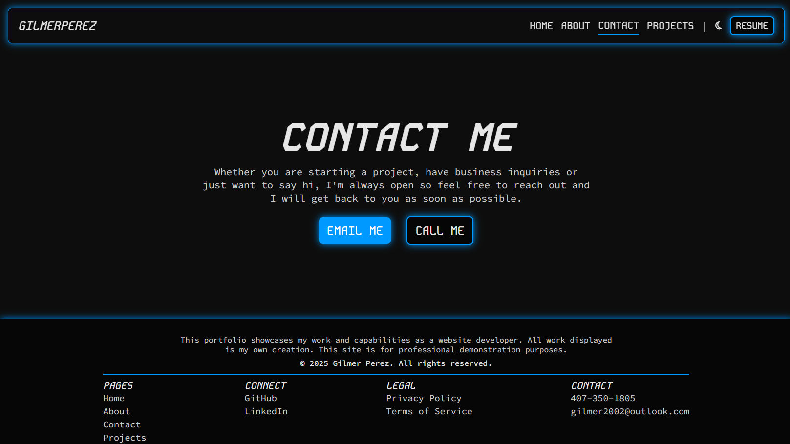
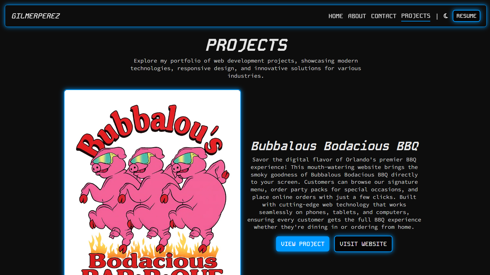
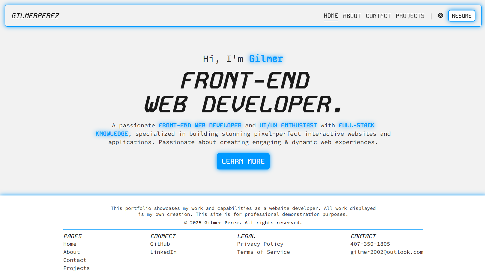

# Gilmer Perez Portfolio

## Description

A modern, responsive portfolio website showcasing my work as a Front-End Web Developer and UI/UX enthusiast. This Next.js-powered application serves as my digital gateway where potential clients, employers, and collaborators can discover my diverse range of projects, technical skills, and professional journey in web development.

- **Problem:** The need for a professional online presence that effectively demonstrates technical capabilities, design sensibilities, and commitment to user experience excellence in today's competitive tech landscape.

- **Solution:** A production-ready portfolio website built with Next.js that combines server-side rendering for optimal SEO performance, client-side interactivity for engaging user experiences, and modern web standards for accessibility and responsiveness.

- **Methodology:** Component-based architecture using Next.js App Router for file-based routing, CSS Modules for scoped styling, and structured JSON data management for maintainable and scalable codebase.

**Live Demo:** [Link to Deployed Application](https://gilmer-perez.vercel.app/)

## Table of Contents

- [Features](#features)
- [Mock Up](#mock-up)
- [Technology Stack](#technology-stack)

## Features

- **Intelligent Navigation System:** Advanced sticky header with scroll-based visibility detection, smooth transitions, and mobile-optimized hamburger menu with portal-based sidebar overlay.

- **Performance-Optimized Delivery:** Next.js automatic code splitting, image optimization, font optimization, and static generation for fast loading times and optimal Core Web Vitals scores.

- **SEO-Optimized Architecture:** Server-side rendering with Next.js App Router, dynamic metadata generation, and optimized image loading for superior search engine visibility and performance.

- **Interactive Profile Experience:** Dynamic profile image switching with click functionality and sophisticated 3D tilt effects using mouse tracking for enhanced user engagement and visual appeal.

- **Accessibility-First Development:** Semantic HTML structure, ARIA labels, keyboard navigation support, screen reader compatibility, and high contrast theme options for inclusive user experience.

- **Advanced Theme Management:** Seamless dark/light mode switching with persistent localStorage preferences, automatic system preference detection, and smooth theme transitions across all components.

- **Comprehensive Project Showcase:** Detailed project galleries featuring four diverse applications with complete case studies, technology breakdowns, and live deployment links for portfolio demonstration.

- **Mobile-First Responsive Design:** Optimized layouts for all screen sizes with collapsible navigation, touch-friendly interactions, and adaptive content presentation ensuring accessibility across devices.

## Mock Up

The following images demonstrate the web application's appearance and functionality:

## Technology Stack

**Frontend:**

- **JavaScript ES6+:** Modern JavaScript features including destructuring, arrow functions, and template literals.
- **Next.js 16:** React framework with App Router for server-side rendering, static generation, and optimized performance.
- **CSS Modules:** Scoped styling system preventing style conflicts while maintaining modular, maintainable CSS architecture.
- **CSS Custom Properties:** Dynamic theming system enabling real-time theme switching and consistent design token management.
- **React 19:** Modern component-based UI library for building interactive user interfaces with hooks and functional components.

**Backend:**

- **Next.js API Routes:** Server-side functionality for handling requests and server-side rendering capabilities.

**Other Technologies:**

- **Local Storage API:** Client-side data persistence for user preferences and theme settings.
- **Vercel Analytics:** Performance monitoring and analytics integration for production deployments.
- **Next.js Image Optimization:** Automatic image optimization and lazy loading for improved performance.
- **Next.js Font Optimization:** Automatic font loading optimization for Kode Mono and Source Code Pro fonts.
- **JSON Data Management:** Structured data storage for projects and technologies enabling easy content updates.
- **Responsive Design:** Mobile-first approach using CSS Grid, Flexbox, and media queries for optimal viewing across all devices.

---
