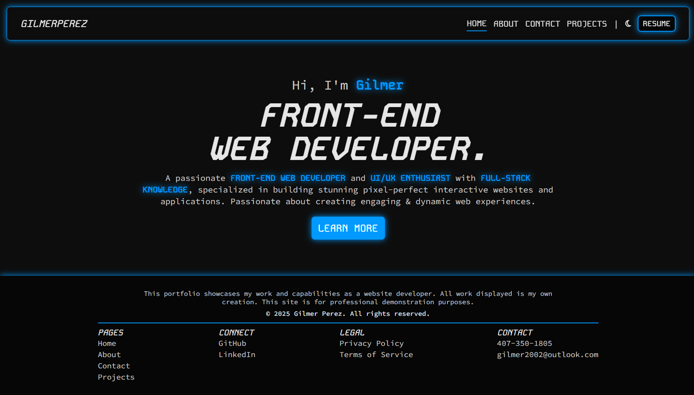
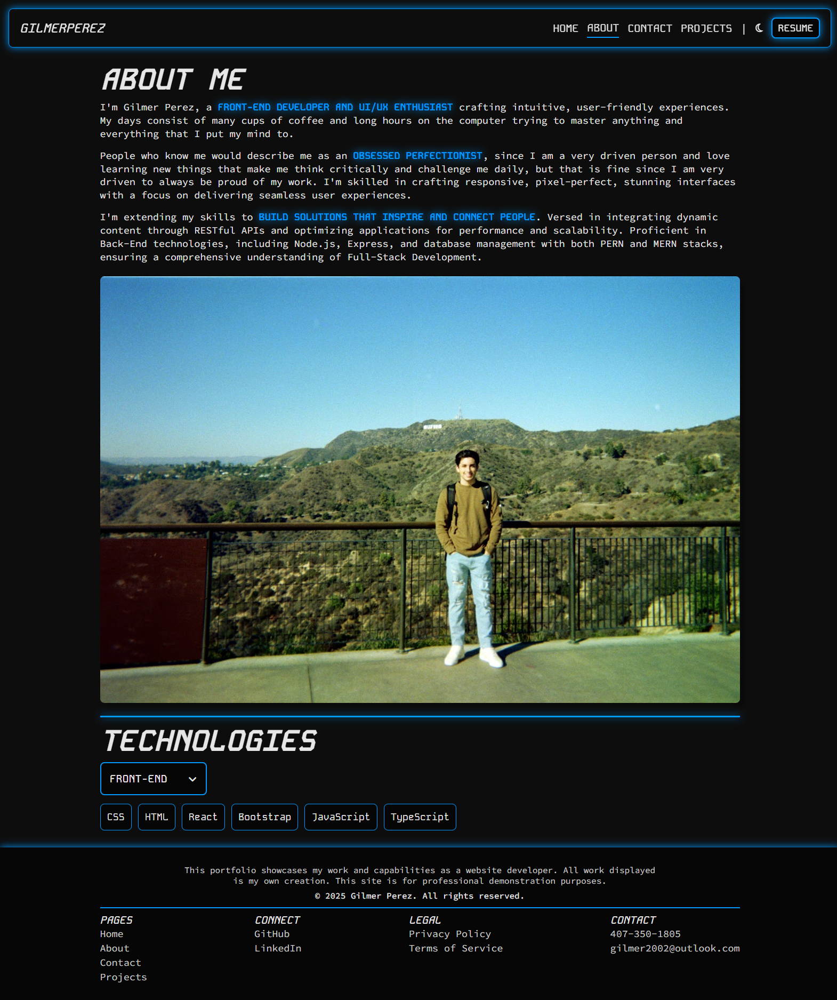
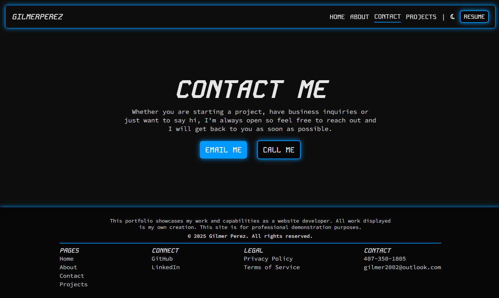
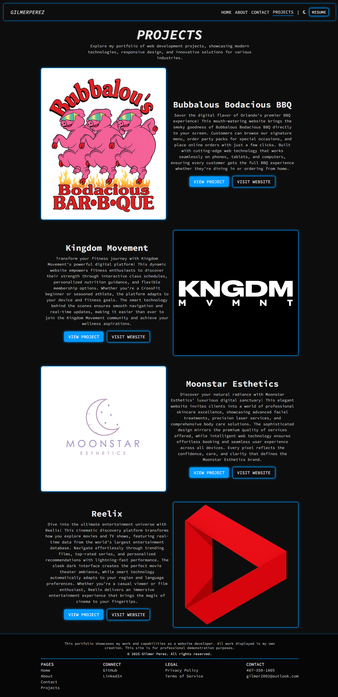
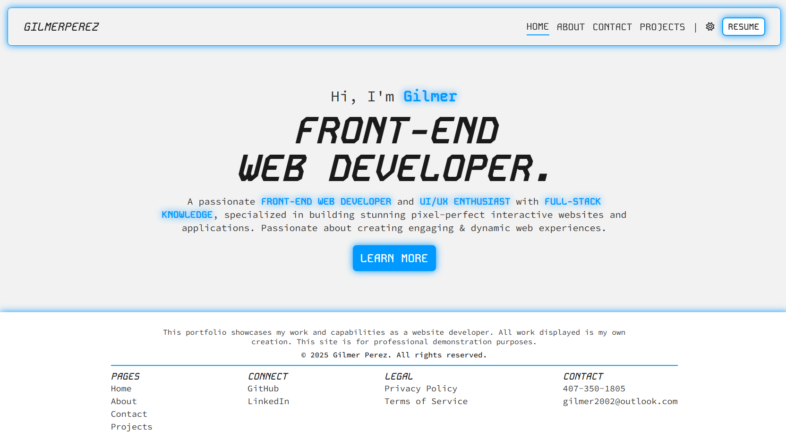

# Portfolio Website

## Project Summary

Welcome to my portfolio website! I've built this modern, responsive web application to showcase my work as a passionate Front-End Web Developer and UI/UX enthusiast. This site serves as my digital gateway where potential clients, employers, and collaborators can discover my diverse range of projects, technical skills, and professional journey in web development.

As a developer, I understand the importance of having a strong professional online presence in today's competitive tech landscape. That's why I've created a website that not only demonstrates my technical capabilities but also reflects my design sensibilities, attention to detail, and commitment to user experience excellence. My portfolio provides a professional, accessible, and engaging platform that effectively communicates my technical expertise while maintaining modern web standards.

Built with React 19, Vite, and modern web technologies, my portfolio features a sophisticated single-page architecture with dynamic routing. Visitors can explore many of my distinct projects. The site includes advanced features like intelligent sticky header navigation, seamless dark/light theme switching, interactive 3D profile image effects, and comprehensive project galleries with detailed case studies. I've also prioritized accessibility with ARIA labels, semantic HTML structure, keyboard navigation support, and mobile-optimized responsive design to ensure optimal viewing experiences across all devices.

## Table of Contents

- [Mock-Up](#mock-up)
- [Key Features](#key-features)
- [Technology Stack](#technology-stack)

## Mock-Up

The following images show the web application's appearance and functionality:

## Key Features

- **Modern Development Practices:** Component-based architecture using React 19, CSS Modules for scoped styling, and structured JSON data management for maintainable and scalable codebase.

- **Intelligent Navigation System:** Advanced sticky header with scroll-based visibility detection, smooth transitions, and mobile-optimized hamburger menu with portal-based sidebar overlay.

- **Performance-Optimized Architecture:** Fast loading times through Vite bundling, efficient component rendering, and optimized asset delivery for superior user experience and SEO performance.

- **Interactive Profile Experience:** Dynamic profile image switching with click functionality and sophisticated 3D tilt effects using mouse tracking for enhanced user engagement and visual appeal.

- **Accessibility-First Development:** Semantic HTML structure, ARIA labels, keyboard navigation support, screen reader compatibility, and high contrast theme options for inclusive user experience.

- **Advanced Theme Management:** Seamless dark/light mode switching with persistent localStorage preferences, automatic system preference detection, and smooth theme transitions across all components.

- **Comprehensive Project Showcase:** Detailed project galleries featuring four diverse applications with complete case studies, technology breakdowns, and live deployment links for portfolio demonstration.

- **Mobile-First Responsive Design:** Optimized layouts for all screen sizes with collapsible navigation, touch-friendly interactions, and adaptive content presentation ensuring accessibility across devices.

- **Professional Contact Integration:** Direct phone calling functionality, resume access through Google Drive integration, and comprehensive contact form for professional networking and collaboration opportunities.

## Technology Stack

- **Portal API:** Advanced DOM manipulation for modal overlays, mobile navigation sidebars, and dynamic content rendering outside component hierarchy.

- **Local Storage API:** Client-side data persistence for user preferences, theme settings, and application state management without server dependencies.

- **Responsive Design:** Mobile-first approach using CSS Grid, Flexbox, and media queries for optimal viewing experiences across all devices and screen sizes.

- **CSS Custom Properties:** Dynamic theming system enabling real-time theme switching, consistent design token management, and flexible color scheme customization.

- **JSON Data Management:** Structured data storage for projects, technologies, and portfolio information enabling easy content updates, maintenance, and scalability.

- **Vite:** Lightning-fast build tool and development server providing instant hot module replacement, optimized production builds, and efficient development workflow.

- **CSS Modules:** Scoped styling system preventing style conflicts while maintaining modular, maintainable CSS architecture with component-specific styling isolation.

- **React 19:** Modern component-based UI library for building interactive user interfaces with hooks, functional components, and advanced state management capabilities.

- **React Router DOM:** Client-side routing solution enabling single-page application navigation with dynamic page titles, URL management, and seamless page transitions.

- **JavaScript ES6+:** Modern JavaScript features including destructuring, arrow functions, template literals, and async/await for clean, readable, and efficient code implementation.
